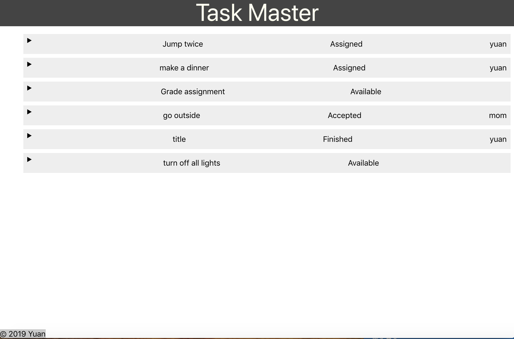

# Task Master Front End
Use React create a frontend website and deploy it to S3. 
## Screenshot of the application

## Link to deployed application on S3
http://taskmaster-yg.s3-website-us-west-2.amazonaws.com/
## Link to backend repo
https://github.com/ygao0719/TaskMaster